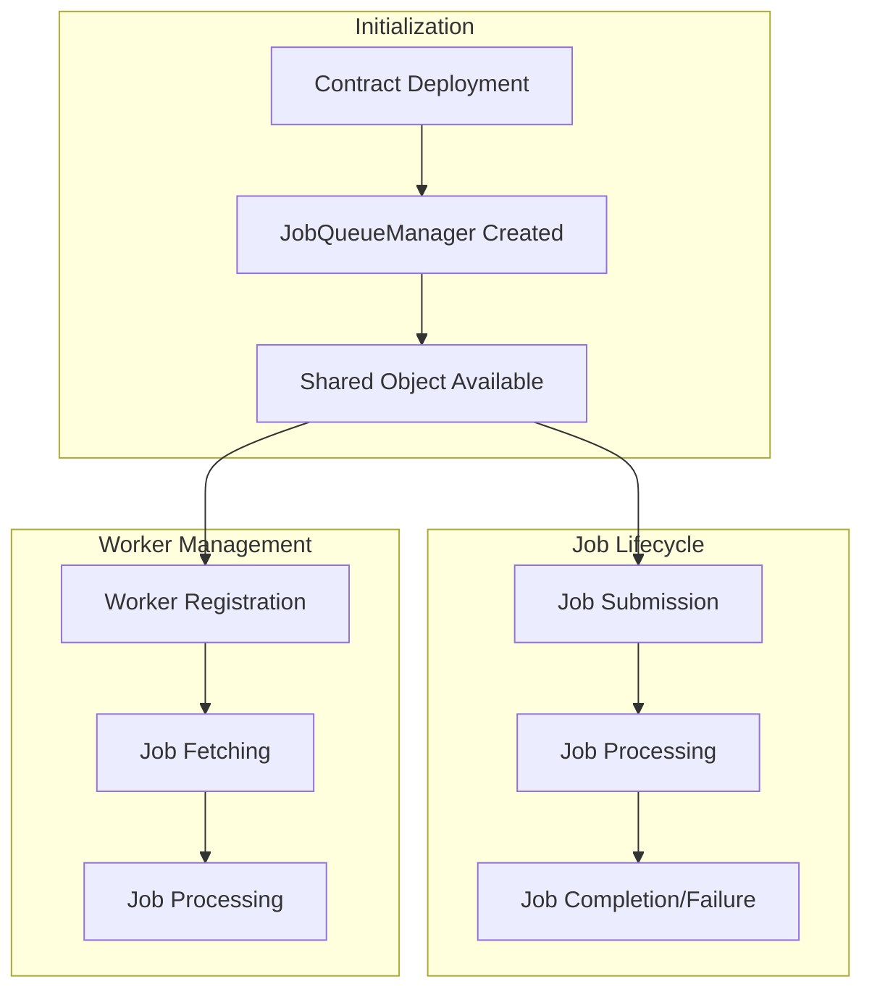
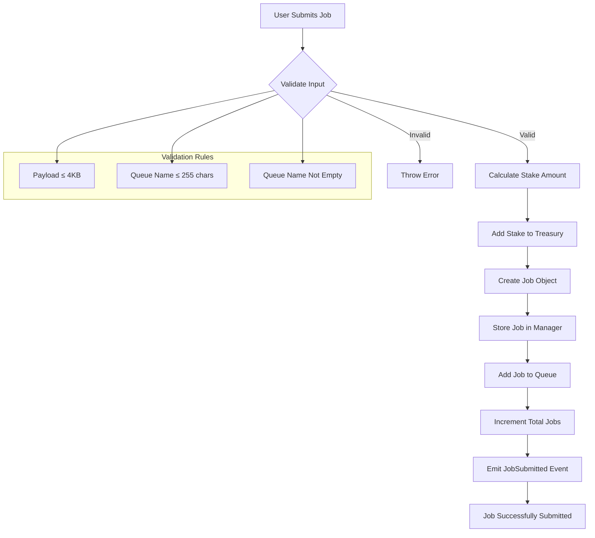
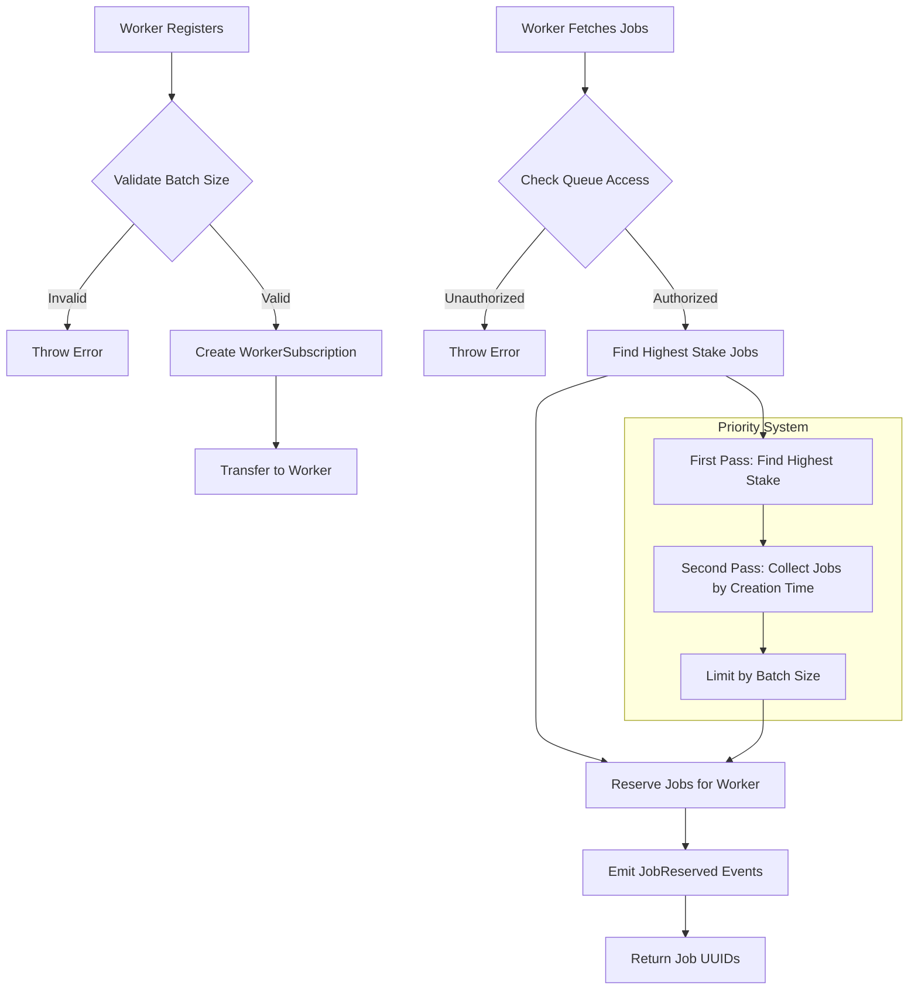
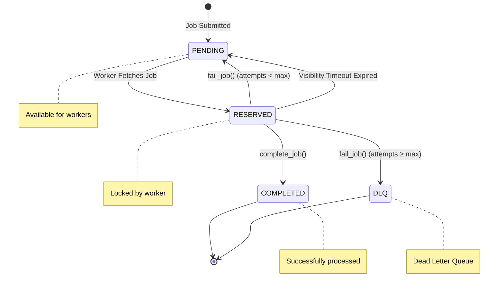
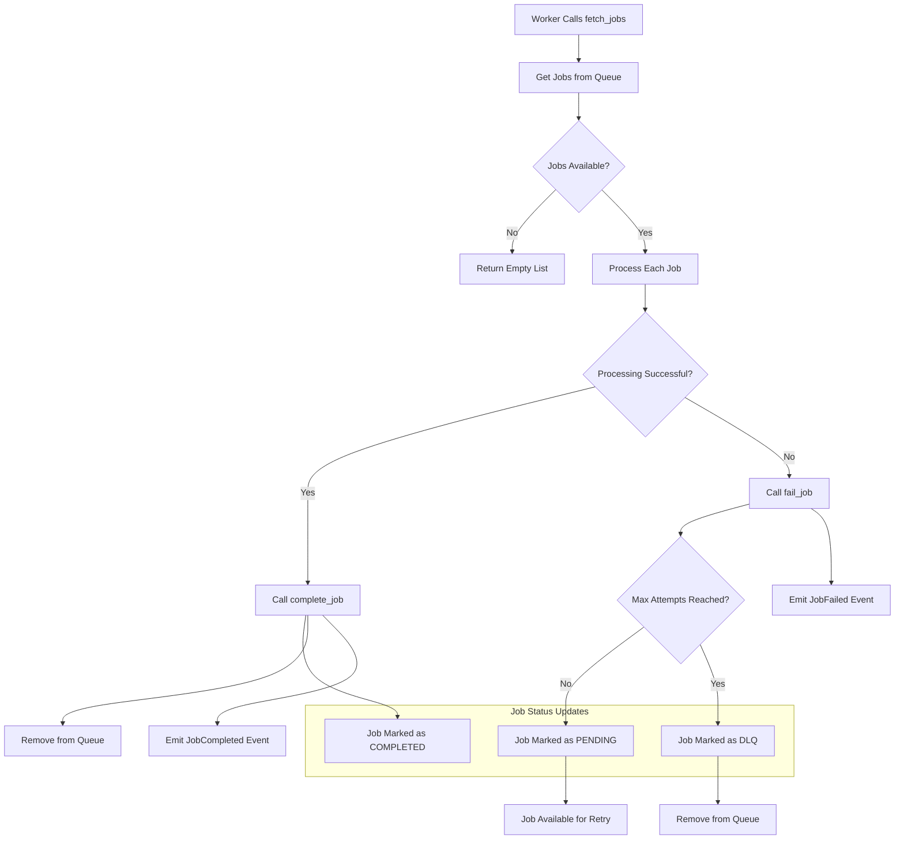
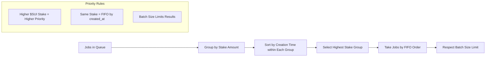
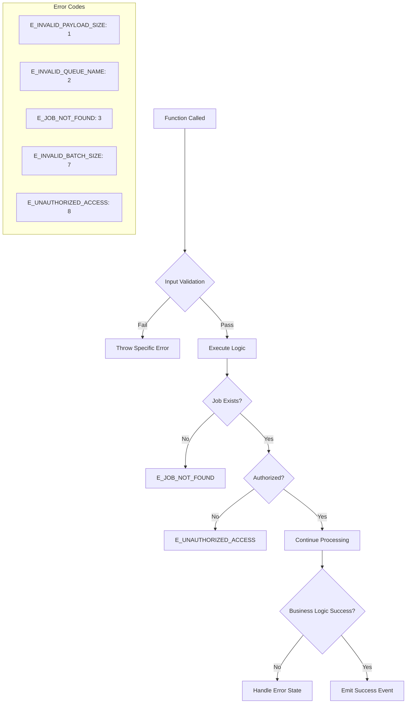
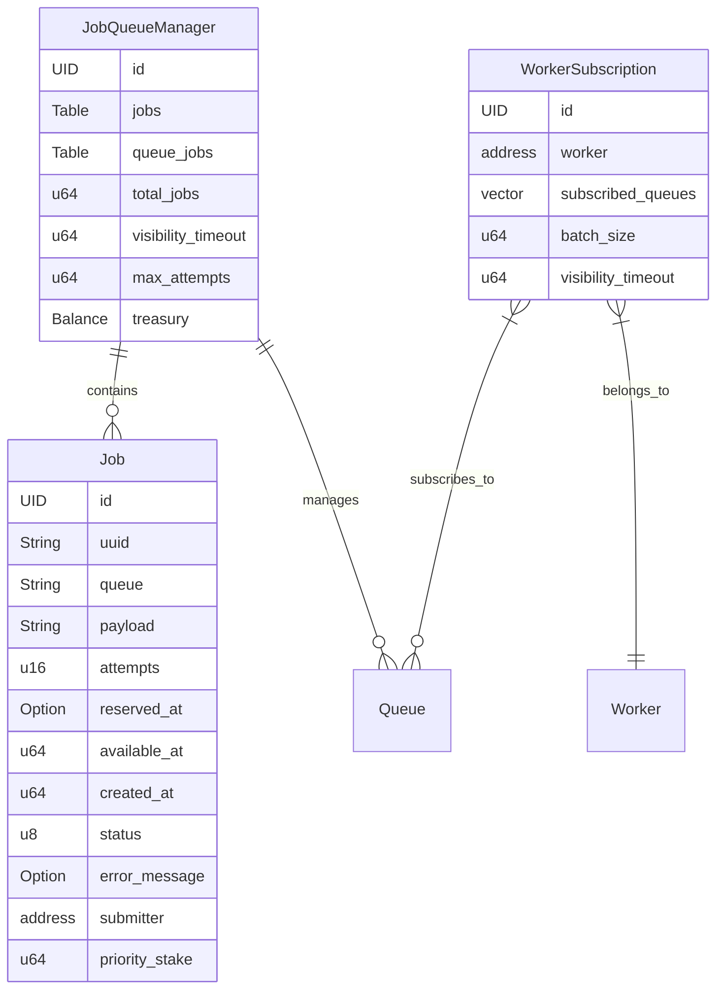
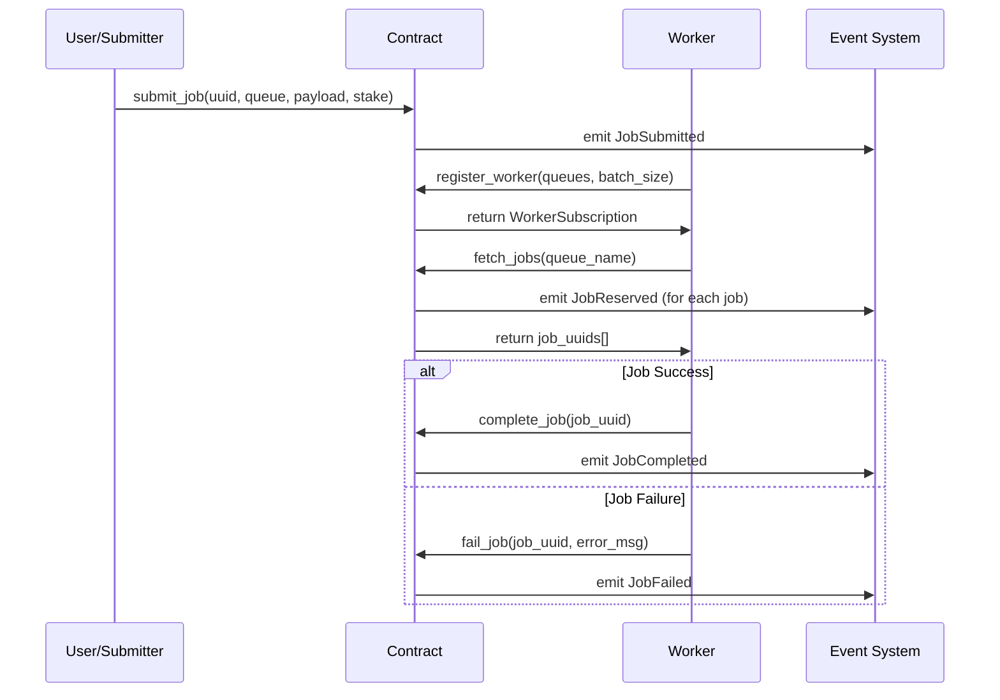

# Job Queue System - Mermaid Flowchart

## Overall System Architecture



## Detailed Job Submission Flow



## Worker Registration and Job Fetching Flow



## Job Processing States and Transitions



## Job Processing Flow (Worker Perspective)



## Priority System Detail



## Error Handling and Edge Cases



## Admin Functions Flow

```mermaid
flowchart TD
    A[Admin Updates Settings] --> B{Function Type}
    B -->|Visibility Timeout| C[Update visibility_timeout]
    B -->|Max Attempts| D[Update max_attempts]
    
    C --> E[Setting Updated]
    D --> E
    
    subgraph "Admin Settings"
        S1[Visibility Timeout: How long jobs stay reserved]
        S2[Max Attempts: Retry limit before DLQ]
    end
    
    note right of E : In production, would check admin permissions
```

## Data Structures Overview



## Event Flow


